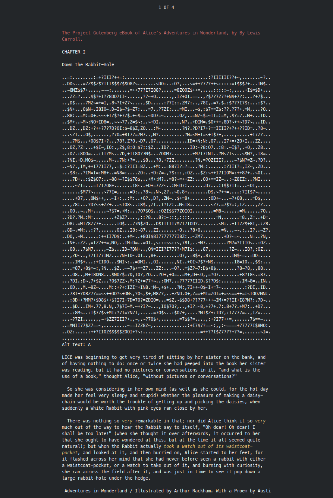

# goreader

Terminal epub reader

[](https://goreportcard.com/report/github.com/taylorskalyo/goreader)

Goreader is an ereader application that runs in the terminal. Images are displayed as ASCII art. Commands are based on less.



## Installation

``` shell
go install github.com/taylorskalyo/goreader
```

## Usage

``` shell
goreader [epub_file]
```

### Default Keybindings

| Action            | Key               |
| ----------------- | ----------------- |
| Exit              | `q` / Escape      |
| Up                | `k` / Up arrow    |
| Down              | `j` / Down arrow  |
| Top               | `g` / Home        |
| Bottom            | `G` / End         |
| Backward          | `b` / PgUp        |
| Forward           | `f` / PgDn        |
| ChapterPrevious   | `H`               |
| ChapterNext       | `L`               |

## Configuration

Custom keybindings and themes can be set by creating a config file at `$XDG_CONFIG_HOME/goreader/config.yml`.

See [example/config.yml](example/config.yml) for an example configuration.
